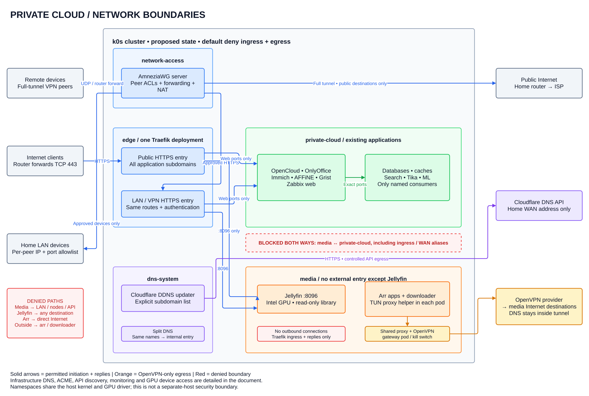

# Networking architecture and boundaries

> **Status:** implemented in repository configuration on 7 September 2026; deployment, router configuration, Cloudflare records, and external acceptance remain operator work.

The cluster uses default-deny pod networking, a restricted host firewall, Traefik for HTTPS and inbound SMTP, AmneziaWG for remote access, and OpenVPN as the guarded media applications' only Internet exit.

[Edit the draw.io source](diagrams/networking.drawio), rendered locally with draw.io Desktop 31.4.4. Arrows show permitted connection initiation; replies follow established connections.

## Trust boundaries

| Namespace / zone | Responsibility | Boundary |
| --- | --- | --- |
| `private-cloud` | Existing applications and dependencies. | Explicit application flows only. |
| `media` | Jellyfin, Sonarr, Radarr, Prowlarr, and qBittorrent. | Jellyfin accepts only Traefik ingress and exits directly for metadata; guarded apps exit through OpenVPN. |
| `edge` | Traefik HTTPS and SMTP entry. | Only approved application listeners are reachable. |
| `network-access` | AmneziaWG server and peer forwarding. | Per-peer LAN permissions and public Internet egress. |
| `dns-system` | Cloudflare DDNS updater. | DNS management has no application-data access. |
| `observability` | Alloy and OpenObserve. | Alloy ingests node logs; OpenObserve provides the authenticated HTTPS interface. |
| `kube-system` / host | CNI, DNS, device plugin, and control plane. | Infrastructure privileges stay outside application workloads. |

The k0s role requires kube-router and labels every namespace used by selector-based policies. Each namespace receives default-deny ingress and egress policies, followed by narrowly scoped exceptions.

This does not isolate workloads from a compromised node, cluster administrator, shared kernel, or shared GPU driver. Stronger isolation requires a separate VM or host.

## Host and router edge

The host installs a persistent nftables table without flushing kube-router rules. Traffic arriving on the default interface is limited to:

| Source | Host port | Purpose |
| --- | --- | --- |
| Any source | TCP `443` | Traefik HTTPS. |
| Any source | TCP `25` | Traefik SMTP proxy. |
| Any source | Configured UDP port | AmneziaWG. |
| Configured local networks | TCP `22` | SSH. |
| Configured local networks | TCP `6443` | Kubernetes API. |
| Configured local networks | TCP `31051` | Zabbix server. |

All other new traffic to the host is dropped, apart from required DHCP, ICMP, loopback, established traffic, and pod-to-node traffic. Direct external forwarding to pod and service CIDRs is dropped unless it belongs to an approved marked connection.

The home router remains outside this repository. It must forward WAN TCP `443`, WAN TCP `25`, and the configured AmneziaWG UDP port to the host address. It must not forward SSH, the Kubernetes API, Zabbix, former application NodePorts, or any media service.

## Traefik entry

Traefik binds host TCP `443` and TCP `25` from a pod in `edge`.

- HTTPS uses exact Kubernetes Ingress host rules and Cloudflare DNS-01 certificates.
- Unknown HTTPS hosts have no matching route.
- The dashboard is disabled.
- Application services are ClusterIP-only.
- Zabbix server TCP `31051` is the only retained NodePort.
- AmneziaWG remains a direct UDP hostPort because HTTP/TCP routing cannot proxy its UDP tunnel protocol usefully.

Public DNS resolves enabled application names to the home WAN address. Split DNS resolves the same names to `networking.traefik_internal_ip` for LAN and AmneziaWG clients. OpenCloud and OnlyOffice callbacks use that internal HTTPS address.

OpenObserve is published through its configured exact HTTPS hostname. Alloy has no public route. When notifications are enabled, OpenObserve and Zabbix may reach only the SMTP relay IP addresses resolved during the last apply; reapply after a relay address change.

## Inbound mail and Stalwart TLS

The external inbox remains the primary Internet receiver and forwards accepted messages to the configured forwarding-domain address. The inbound path is:

`Internet sender → external inbox → forwarding-domain MX → router TCP 25 forward → Traefik hostPort 25 → raw TCP proxy with Proxy Protocol v2 → Stalwart ClusterIP TCP 25`

Port `25` is required for the forwarding service's server-to-server SMTP delivery. The repository does not expose submission ports `465` or `587`, IMAPS `993`, or a direct Stalwart HTTPS port.

JMAP, web access, and administration use the mail hostname on Traefik HTTPS TCP `443`. Stalwart relays non-local outbound messages through the configured external `inbox.eu` SMTP service.

Stalwart accepts STARTTLS on SMTP TCP `25`, trusts Proxy Protocol only from the configured pod network, and performs its own message filtering. The host firewall therefore does not restrict SMTP to forwarding-service CIDRs.

Stalwart owns its mail certificate lifecycle. It uses a dedicated Cloudflare DNS token to complete Let's Encrypt DNS-01 challenges, install the certificate for the configured mail hostname, and renew it before expiry. Traefik neither terminates SMTP TLS nor supplies Stalwart's certificate.

The Stalwart certificate token and DDNS token are separate credentials:

- The Stalwart token proves DNS control during certificate issuance and renewal.
- The DDNS token updates the configured public A records when the WAN address changes.

The primary receiving domain's MX records remain pointed at the external inbox provider. The forwarding domain's MX record points at the Stalwart mail hostname, whose A record is maintained by DDNS.

The operator must still publish and verify PTR, SPF, DKIM, and DMARC records appropriate to the external receiving and outbound-relay design.

## Guarded media egress

The [arr stack templates](../k0s-services/arr/README.md) own the guarded applications, OpenVPN gateway, and shared library storage. The media installer stage renders them separately from [Jellyfin](../k0s-services/jellyfin/README.md).

Sonarr, Radarr, Prowlarr, and qBittorrent share one OpenVPN gateway pod. Each guarded application pod has a `tun2socks` helper and no direct Internet route permitted by NetworkPolicy.

- The helper sends external TCP and UDP through the gateway's Shadowsocks listener.
- The gateway may reach only the pinned OpenVPN endpoint outside the tunnel.
- Gateway CoreDNS sends external lookups through the OpenVPN route.
- Cluster-local DNS is forwarded to the configured cluster DNS address.
- Guarded apps may reach only gateway DNS/proxy ports and declared media APIs.
- IPv6 is disabled until equivalent capture and filtering exist.
- VPN failure leaves guarded Internet traffic blocked.
- qBittorrent binds to `tun0`, disables UPnP, and enables anonymous mode.

Sonarr and Radarr can reach Prowlarr and qBittorrent on their API ports. Prowlarr can reach Sonarr and Radarr for synchronization. These paths use cluster networking rather than OpenVPN.

The arr dashboards, qBittorrent UI, peer port, discovery protocols, and UPnP are not published.

## Jellyfin

Jellyfin accepts only Traefik connections on TCP `8096`. It resolves names through cluster DNS and reaches metadata and artwork providers on TCP `443`.

Jellyfin uses the local read-only media library and one shared `gpu.intel.com/i915` allocation. Metadata and image download stay enabled; subtitle, plugin, and remote-media integrations remain disabled.

## AmneziaWG

AmneziaWG runs in `network-access` with pod networking and one UDP hostPort. The host installs the pinned AmneziaWG kernel module, while tunnel routes, NAT, and peer ACLs are created only inside the pod network namespace.

This keeps Amnezia-specific interface settings and iptables rules out of the host network namespace and prevents them from changing other pods' routing or firewall rules. The pod still has `NET_ADMIN`, so its image and configuration remain infrastructure-trusted.

| Peer destination | Route | Enforcement |
| --- | --- | --- |
| Public Internet | Peer → AmneziaWG → host uplink → ISP. | Pod firewall permits public destinations and applies NAT. |
| Application names | Peer → split DNS → Traefik TCP `443`. | Only approved HTTPS hosts route to backends. |
| LAN devices | Peer → AmneziaWG → configured LAN IP and port. | Per-peer allowlists are enforced in the pod. |
| Other peers, pod CIDRs, service CIDRs, and media APIs | No route. | Pod firewall denies the connection. |

The tunnel subnet must not overlap local, pod, service, or common client networks. Each peer receives a unique key and address. Client `AllowedIPs` settings select routes but do not replace server-side authorization.

## Cloudflare DDNS

A CronJob in `dns-system` discovers the current public IPv4 address and updates only the configured Cloudflare A records. It uses a token distinct from both Traefik ACME and Stalwart ACME.

DDNS changes DNS records only. It does not configure the router, create NAT rules, bypass CGNAT, or make an ISP-blocked TCP `25` reachable.

## Allowed connection matrix

Everything omitted is denied. Each entry permits connection initiation in the stated direction and the associated replies.

| Source | Destination | Allowed scope |
| --- | --- | --- |
| WAN | Traefik | TCP `443` and TCP `25`. |
| WAN | AmneziaWG | Configured UDP port. |
| Local networks | Host | TCP `22`, `6443`, and `31051`. |
| LAN / AmneziaWG client | Traefik | TCP `443`. |
| Traefik | Approved web backends / Jellyfin | Declared backend ports only. |
| Jellyfin | Metadata and artwork providers | TCP `443` after cluster DNS. |
| Traefik | Stalwart | TCP `25` with Proxy Protocol v2. |
| Guarded media pod | Media VPN gateway | Proxy and DNS ports only. |
| Media VPN gateway | OpenVPN provider | Pinned endpoint IP, protocol, and port. |
| Media integrations | Declared arr / qBittorrent APIs | Required API ports only. |
| AmneziaWG peer | Approved LAN target | Per-peer destination IPs and ports. |
| AmneziaWG peer | Public Internet | Full-tunnel forwarding after private-range denials. |
| Declared application | PostgreSQL and internal dependency | Service-specific ports only. |
| Stalwart | Cloudflare, Let's Encrypt, DNS, relay, and mail lookups | Required service ports only. |
| Traefik / DDNS | Cloudflare, Let's Encrypt, DNS, and IP discovery | Required service ports only. |
| OpenObserve / Zabbix | Configured inbox.eu SMTP relay | Resolved relay addresses and configured SMTP port only. |

## Storage

Traefik, Jellyfin, each arr service, qBittorrent, and the media library have separate quota-controlled datasets under `tank/secure/backup/k0s/services` and dedicated `10Ti` PVs. Jellyfin mounts the library read-only; import and download workloads receive only their required write mounts.

## Deployment acceptance

Repository implementation is not evidence of live enforcement. Before exposure:

- Confirm the router forwards only TCP `25`, TCP `443`, and the AmneziaWG UDP port.
- Verify all other host and former NodePort paths fail from WAN and LAN.
- Verify SSH, Kubernetes API, and Zabbix work only from configured local networks.
- Test every hostname from WAN, LAN, and AmneziaWG.
- Validate Traefik and Stalwart certificate issuance and renewal paths.
- Send a message to the external inbox and confirm its SMTP forward reaches Stalwart.
- Confirm Proxy Protocol preserves the sender address in Stalwart.
- Verify Stalwart filtering and outbound relay behavior.
- Interrupt OpenVPN and confirm guarded apps lose Internet and external DNS.
- Confirm Jellyfin downloads metadata over IPv4 and cannot initiate IPv6 connections.
- Confirm Jellyfin streaming and local scanning continue during media VPN failure.
- Verify per-peer AmneziaWG LAN permissions and full-tunnel Internet egress.
- Confirm qBittorrent reports `tun0` as its bound interface.
- Verify Jellyfin transcoding uses the Intel GPU.
- Confirm OpenObserve is reachable only through its configured hostname.
- Confirm Alloy has no public route and accepts only its documented internal health path.
